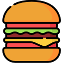

# make-your-burguer

<p align="center">
   
</p>
[](https://github.com/SamuelAlv3s)
[](#)

## Project setup

```
npm install
```

### Compiles and hot-reloads for development

```
npm run serve
```

### Customize configuration

See [Configuration Reference](https://cli.vuejs.org/config/).
